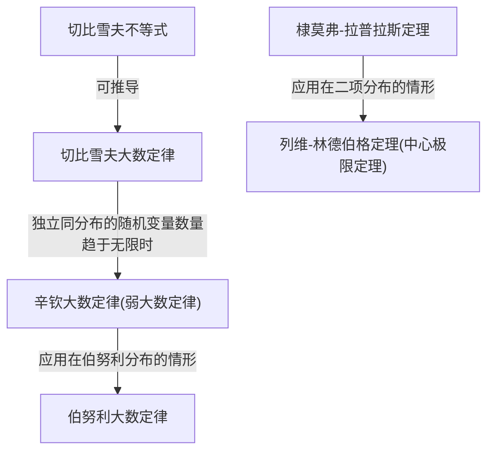

# 概率论·5 大数定律和中心极限定理

## 考纲摘要

- 切比雪夫（Chebyshev）不等式
- 切比雪夫大数定律
- 伯努利（Bernoulli）大数定律
- 辛钦（Khinchin）大数定律
- 棣莫弗-拉普拉斯（DeMolvre-Laplace）定理
- 列维-林德伯格（Levy-Lindberg）定理

## 一、大数定理

### 0x00 切比雪夫大数定理

> 考纲摘要：了解切比雪夫不等式、了解切比雪夫大数定律

> 如果 $X$ 是一个非负的随机变量，那么 $P(X\ge a)$ 的上界是什么？
>
> 定义一个指示函数：
> $$
> I_{X\ge a}=\begin{cases}
> 1&x\ge a\\
> 0&x<a
> \end{cases}
> $$
> 显然，$E(I_{X\ge a})=P(X\ge a)$
>
> 发现 $X\ge aI_{X\ge a}$，这是因为，当 $X\ge a$ 时，$I_{X\ge a}=1$，自然也满足 $X\ge aI_{X\ge a}$，而当 $X<a$ 时，$I_{X\ge a}=0$，而 $X>0$，因此该不等式也满足
>
> 由于 $X,aI_{X\ge a}$ 都是非负的，因此有：
> $$
> E(X)\ge E(aI_{X\ge a})=aE(I_{X\ge a})=aP(X\ge a)
> $$
> 因此：
> $$
> P(X\ge a)\le\frac{E(X)}a
> $$
> 这就是**马尔可夫不等式**
>
>  以此为基础推导切比雪夫不等式：
>
> 对于任意随机变量 $X$，它具有数学期望 $\mu$，方差 $\sigma^2$，那么，对于 $\forall \varepsilon>0$，根据马尔可夫不等式，直接有：
> $$
> P[(X-\mu)^2\ge\varepsilon^2]=P(|X-\mu|\ge\varepsilon)\le\frac{E[(X-\mu)^2]}{\varepsilon^2}=\frac{\sigma^2}{\varepsilon^2}
> $$
> 切比雪夫不等式的另一种形式也可以利用同样的方法推导：
> $$
> P[(X-\mu)^2\ge\sigma^2\varepsilon^2]=P(|X-\mu|\ge\sigma\varepsilon)\le
> \frac{E[(X-\mu)^2]}{\sigma^2\varepsilon^2}=\frac{1}{\varepsilon^2}
> $$
> 

*切比雪夫（Chebyshev）大数定理，也称切比雪夫不等式，是概率论中的一个重要结果，用于估计随机变量的分布偏离其期望值的概率。定理表明，对于任何具有有限期望值和有限方差的随机变量，其值偏离期望值超过某个特定范围的概率是有界的。*

**切比雪夫不等式**：设随机变量 $X$ 具有数学期望 $E(X)=\mu$，方差 $D(X)=\sigma^2$，则：
$$
\forall \varepsilon>0,P\{|x-\mu|\ge\varepsilon\}\le\frac{\sigma^2}{\varepsilon^2}
$$

切比雪夫不等式的另一种表述：
$$
\forall \varepsilon>0,P\{|x-\mu|\ge\varepsilon\sigma\}\le\frac{1}{\varepsilon^2}
$$
*切比雪夫不等式的重要性在于它在没有关于随机变量的分布形状的任何假设下，提供了一个普遍适用的界限。这使得它在许多领域中都具有广泛的应用，包括**统计学**、工程学和金融学等。*

切比雪夫大数定律：
$$
P\left(\left|
\frac{1}{n}\sum_{i=1}^n X_i-\mu
\right|\ge\varepsilon\right)\le\frac{\sigma^2}{n\varepsilon^2}
$$

### 0x01 辛钦大数定理（弱大数定理）

> 考纲摘要：了解辛钦大数定律（独立同分布随机变量序列的大数定律）

弱大数定理（辛钦大数定理）：

设 $X_1,X_2,\cdots$ 是相互独立且服从同一分布的随机变量序列，且具有数学期望 $E(X_k)=\mu,k=1,2,\cdots$，则有：
$$
\forall\varepsilon>0,\lim_{n\to\infty} P\left\{
    \left|
        \frac1n\sum_{k=1}^nX_k-\mu
    \right|<\varepsilon
\right\}=1\\
\forall\varepsilon>0,\lim_{n\to\infty} P\left\{
    \left|
        \frac1n\sum_{k=1}^nX_k-\mu
    \right|\ge\varepsilon
\right\}=0
$$
也就是说，对于相互独立且服从同一分布，且数学期望为 $\mu$ 的随机变量 $X_1,\cdots,X_n$。当 $n$ 很大时，它们的算术平均 $\cfrac1n\sum_{k=1}^n X_k$ 大概率接近 $\mu$

### 0x02 伯努利大数定理

> 考纲摘要：了解伯努利大数定律

设 $f_A$ 是 $n$ 次独立重复试验中事件 $A$ 发生的次数，$p$ 是事件 $A$ 在每次试验中发生的概率，则
$$
\forall\varepsilon>0,\lim_{n\to\infty}P\left\{
    \left|
        \frac{f_A}{n}-p
    \right|<\varepsilon
\right\}=1\\
\forall\varepsilon>0,\lim_{n\to\infty}P\left\{
    \left|
        \frac{f_A}{n}-p
    \right|\ge\varepsilon
\right\}=0
$$
伯努利大数定律表明，当试验次数很大时，可以用事件的频率代替事件的概率

## 二、中心极限定理

### 0x00 列维-林德伯格定理（独立同分布的中心极限定理）

> 考纲摘要：列维-林德伯格定理（独立同分布随机变量序列的中心极限定理）

设随机变量 $X_1,X_2,\cdots,X_n,\cdots$ 相互独立且服从同一分布
且具有数学期望和方差 $E(X_k)=\mu,D(X_k)=\sigma^2,k=1,2,\cdots$
则随机变量之和 $\sum_{k=1}^n X_k$ 的标准化变量
$$
Y_n=\cfrac{\sum_{k=1}^nX_k-E(\sum_{k=1}^nX_k)}{\sqrt{D(\sum_{k=1}^nX_k)}}=\cfrac{\sum_{k=1}^nX_k-n\mu}{\sqrt n\sigma}
$$
的分布函数 $F_n(x)$ 满足
$$
\forall x,\lim_{n\to\infty}F_n(x)=\lim_{n\to\infty}P\left\{
    \cfrac{\sum_{k=1}^nX_k-n\mu}{\sqrt n\sigma}\le x
\right\}=\int_{-\infty}^x\frac1{\sqrt{2\pi}}e^{-t^2/2}\mathrm dt=\Phi(x)
$$
也就是说，$n$ 同分布的独立随机变量之和，当 $n$ 越大时，其标准化变量越近似于标准正态分布 $N(0,1)$

### 0x01 棣莫弗-拉普拉斯定理（二项分布以正态分布为极限分布）

> 考纲摘要：了解棣莫弗-拉普拉斯定理(二项分布以正态分布为极限分布）

设随机变量 $\eta_n,n=1,2,\cdots$ 服从参数为 $n,p$ 的二项分布，则对于任意 $x$，有：
$$
\lim_{n\to\infty}P\left\{
\frac{\eta_n-np}{\sqrt{np(1-p)}}\le x
\right\}=\int_{-\infty}^x\frac1{\sqrt{2\pi}}e^{-t^2/2}\mathrm dt=\Phi(x)
$$

### 0x02 李雅普诺夫定理

> 考纲摘要：该定理不在 2024 年考研数学（一）的考试大纲内

设随机变量 $X_1,X_2,\cdots,X_n,\cdots$ 相互独立，且分别具有数学期望和方差 $E(X_k)=\mu_k,D(X_k)=\sigma_k^2,k=1,2,\cdots$
记 $B_n^2=\sum_{k=1}^n\sigma_k^2$

如果
$$
\exist\delta>0,\lim_{n\to\infty}\frac1{B^{2+\delta}_n}\sum_{k=1}^nE\{|X_k-\mu_k|^{2+\delta}\}=0
$$
则随机变量之和 $\sum_{k=1}^n X_k$ 的标准化变量
$$
Z_n=\cfrac{\sum_{k=1}^nX_k-E(\sum_{k=1}^nX_k)}{\sqrt{D(\sum_{k=1}^nX_k)}}=\cfrac{\sum_{k=1}^nX_k-\sum_{k=1}^n\mu_k}{B_n}
$$
的分布函数 $F_x(x)$ 满足
$$
\forall x,\lim_{x\to\infty}F_n(x)=\lim_{x\to\infty}P\left\{
\cfrac{\sum_{k=1}^nX_k-\sum_{k=1}^n\mu_k}{B_n}\le x
\right\}=\int_{-\infty}^x\frac1{\sqrt{2\pi}}e^{-t^2/2}\mathrm dt=\Phi(x)
$$
