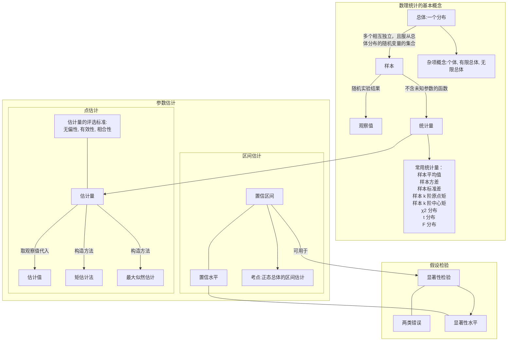
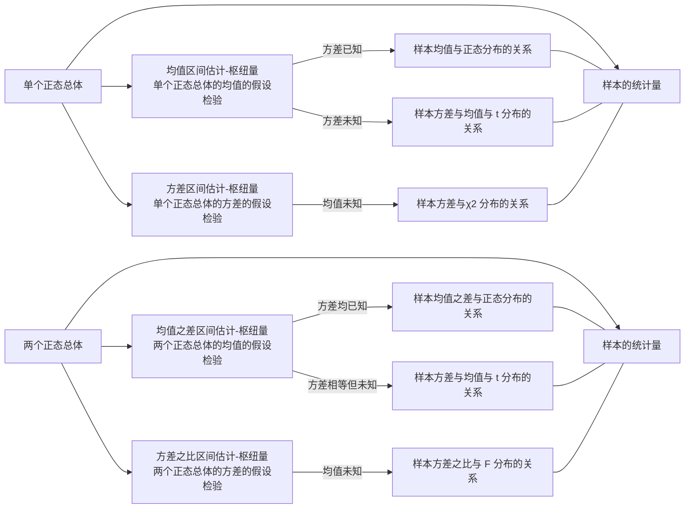

# 故事新编之数理统计

## 考纲内容

### 0x00 考纲原文摘录

- **数理统计的基本概念**

  - **考试内容：**

    - 总体、个体、简单随机样本、统计量、样本均值、样本方差、样本矩
    - $\chi^2$ 分布，$t$ 分布，$F$ 分布，分位数，正态总体的常用抽样分布

  - **考试要求：**

    - 理解总体、简单随机样本、统计量、样本均值、样本方差及样本矩的概念，其中样本方差定义为
      $$
      S^2=\frac1{n-1}\sum_{i=1}^n(X_i-\overline X)^2
      $$

    - 了解 $\chi^2$ 分布、$t$ 分布和 $F$ 分布的概念及性质，了解上侧 $\alpha$ 分位数的概念并会**查表计算**

    - 了解正态总体的常用抽样分布

- **参数估计**

  - **考试内容：**
    - 点估计的概念
    - 估计量与估计值
    - 矩估计法
    - 最大似然估计法
    - 估计量的评选标准
    - 区间估计的概念
    - 单个正态总体的均值和方差的区间估计
    - 两个正态总体的均值差和方差比的区间估计
  - **考试要求：**
    - 理解参数的点估计、估计量与估计值的概念
    - 掌握矩估计法（一阶矩、二阶矩）和最大似然估计法
    - 了解估计量的无偏性、有效性（最小方差性）和一致性（相合性）的概念，并会验证估计量的无偏性
    - 理解区间估计的概念，会求单个正态总体的均值和方差的置信区间，会求两个正态总体的均值差和方差比的置信区间

- **假设检验**：

  - **考试内容**：
    - 显著性检验
    - 假设检验的两类错误
    - 单个及两个正态总体的均值和方差的假设检验
  - **考试要求**：
    - 理解显著性检验的基本思想，掌握假设检验的基本步骤，了解假设检验可能产生的两类错误
    - 掌握单个及两个正态总体的均值和方差的假设检验

### 0x01 知识关系图

#### 1. 整体知识结构

#### 2. 正态总体视图

由于置信区间与假设检验主要考察正态总体下的情形，因此这里我们将正态总体下涉及到的相关知识点整理成脑图

## 一、数理统计的基本概念

### 0x00 随机样本诸概念的定义

- 设 $ X $ 是具有分布函数 $ F $ 的随机变量。若 $ X_1, X_2, \cdots, X_n $ 是具有相同分布函数 $ F $ 的、相互独立的随机变量
  则称 $ X_1, X_2, \cdots, X_n $ 为从分布函数 $ F $（或**总体** $ F $，或总体 $ X $）得到的容量为 $ n $ 的**简单随机样本**，简称 **样本**

- 它们的观察值 $ x_1, x_2, \cdots, x_n $ 称为 **样本值**，又称为 $ X $ 的 $ n $ 个**独立的观察值**。

- **总体**的每一个可能的观察值称为**个体**
  总体中包含的所有个体的总数称为**总体的容量**

  根据容量的大小，可以将总体分为：

  - **有限总体**：容量有限的总体，例如总体为二项分布时。
  - **无限总体**：容量无限的总体，例如总体为泊松分布时。

### 0x01 统计量

定义：设 $ X_1, X_2, \cdots, X_n $ 是来自总体 $ X $ 的一个样本

- $ g(X_1, X_2, \cdots, X_n) $ 是 $ X_1, X_2, \cdots, X_n $ 的函数
- 若 $ g $ 中**不含未知参数**，则称 $ g(X_1, X_2, \cdots, X_n) $ 是一**统计量**。

因为 $ X_1, X_2, \cdots, X_n $ 都是随机变量，而统计量 $ g(X_1, X_2, \cdots, X_n) $ 是随机变量的函数，因此统计量是一个**随机变量**。

设 $ x_1, x_2, \cdots, x_n $ 是相应于样本 $ X_1, X_2, \cdots, X_n $ 的样本值，则称 $ g(x_1, x_2, \cdots, x_n) $ 是 $ g(X_1, X_2, \cdots, X_n) $ 的**观察值**。

下面列出几个常用的统计量及其观察值。设 $ X_1, X_2, \cdots, X_n $ 是来自总体 $ X $ 的一个样本，$ x_1, x_2, \cdots, x_n $ 是这一样本的观察值。

#### 1. 样本平均值

$$
\overline{X} = \frac{1}{n} \sum_{i=1}^n X_i,\overline{x} = \frac{1}{n} \sum_{i=1}^n x_i
$$

#### 2. 样本方差

$$
S^2 = \frac{1}{n-1} \sum_{i=1}^n (X_i - \overline{X})^2 = \frac{1}{n-1} \left( \sum_{i=1}^n X_i^2 - n \overline{X}^2 \right)\\
S^2 = \frac{1}{n-1} \sum_{i=1}^n (x_i - \overline{x})^2 = \frac{1}{n-1} \left( \sum_{i=1}^n x_i^2 - n \overline{x}^2 \right)
$$

#### 3. 样本标准差

$$
S = \sqrt{S^2} = \sqrt{\frac{1}{n-1} \sum_{i=1}^n (X_i - \overline{X})^2}\\
S = \sqrt{S^2} = \sqrt{\frac{1}{n-1} \sum_{i=1}^n (x_i - \overline{x})^2}
$$

#### 4. 样本 $ k $ 阶（原点）矩

$$
A_k = \frac{1}{n} \sum_{i=1}^n X_i^k, \quad k = 1, 2, \cdots\\
A_k = \frac{1}{n} \sum_{i=1}^n x_i^k, \quad k = 1, 2, \cdots
$$

#### 5. 样本 $ k $ 阶中心矩

$$
B_k = \frac{1}{n} \sum_{i=1}^n (X_i - \overline{X})^k, \quad k = 2, 3, \cdots\\
B_k = \frac{1}{n} \sum_{i=1}^n (x_i - \overline{x})^k, \quad k = 2, 3, \cdots
$$

### 0x02 正态总体相关的统计量

这些统计量在正态总体的区间估计和假设检验中是有用的，但它们的计算只需查表即可，只需了解它们的性质和查表方法即可。

#### 1. $\chi^2$ 分布

##### (1) 定义及图像

设 $X_1,X_2,\cdots,X_n$ 是来自总体 $N(0,1)$ 的样本，则称统计量
$$
\chi^2=X_1^2+X_2^2+\cdots+X_n^2
$$
为服从自由度为 $n$ 的 $\chi^2$ 分布，记作 $\chi^2\sim\chi^2(n)$

$\chi^2(n)$ 分布的概率密度为
$$
f(y)=\begin{cases}
\cfrac1{2^{n/2}\Gamma(n/2)}y^{n/2-1}e^{-y/2},&y>0\\
0,&y\le0
\end{cases}
$$
其图像如下所示：

##### (2) 性质

- $\chi^2$ 分布的**可加性**：设 $\chi_1^2\sim\chi^2(n_1),\chi_2^2\sim\chi^2(n_2)$，且 $\chi_1^2,\chi_2^2$ 相互独立，则有 $\chi_1^2+\chi_2^2\sim\chi^2(n_1+n_2)$
- $\chi^2$ 分布的数学期望和方差：对于 $\chi^2\sim\chi^2(n)$，$E(\chi^2)=n,D(\chi^2)=2n$

##### (3) $\chi^2$ 分布的分位点

$\chi^2$ 分布的分位点：对于给定的 $0<\alpha<1$，称满足条件
$$
P\{\chi^2>\chi_\alpha^2(n)\}=\int_{\chi_\alpha^2(n)}^\infty f(y)\mathrm dy=\alpha
$$
的点 $\chi_\alpha^2(n)$ 为 $\chi^2(n)$ 上的 $\alpha$ 分位点，求法如下：

- $n$ 在 40 及以下时，查表
- $n$ 充分大时，近似的有 $\chi_\alpha^2(n)\approx\cfrac12(z_\alpha+\sqrt{2n-1})^2$，在 $n>40$ 时可采用该近似式

> $\chi_\alpha^2(n)$ 是一个仅与 $\alpha,n$ 有关的常数

#### 2. $t$ 分布

##### (1) 定义及图像

设 $X\sim N(0,1),Y\sim\chi^2(n)$，且 $X,Y$ 相互独立，则称随机变量
$$
t=\frac X{\sqrt{Y/n}}
$$
为服从自由度为 $n$ 的 $t$ 分布，记作 $t\sim t(n)$，它也称作学生氏分布，其概率密度函数为：
$$
h(t)=\frac{\Gamma[(n+1)/2]}{\sqrt{\pi n}\Gamma(n/2)}(1+\frac{t^2}n{})^{-(n+1)/2},t\in\R
$$
其图像如下所示：

$t$ 分布概率密度函数的图像是关于 $t=0$ 轴对称的。此外，由于
$$
\lim_{n\to\infty}h(t)=\frac1{\sqrt{2\pi}}e^{-t^2/2}
$$
也就是说，当 $n$ 足够大时，$t$ 分布的近似于 $N(0,1)$ 分布

##### (2) $t$ 分布的分位点

$t$ 分布的分位点：对于给定的 $0<\alpha<1$，称满足条件
$$
P\{t>t_\alpha(n)\}=\int_{t_\alpha(n)}^\infty h(t)\mathrm dt=\alpha
$$
的点  $t_\alpha(n)$ 为 $t(n)$ 分布上的 $\alpha$ 分位点
由于 $t$ 分布图像的对称性，可知 $t_{1-\alpha}(n)=-t_\alpha(n)$。该分布的分位点也可以通过查表来求解

#### 3. $F$ 分布

##### (1) 定义及图像

设 $U\sim \chi^2(n_1),V\sim\chi^2(n_2)$ 且相互独立，则称随机变量 $F=\cfrac{U/n_1}{V/n_2}$
为服从自由度为 $(n_1,n_2)$ 的 $F$ 分布，记作 $F\sim F(n_1,n_2)$，由定义知：$\cfrac1F\sim F(n_2,n_1)$

其概率密度为：
$$
\psi(y)=\begin{cases}
\cfrac{\Gamma[(n_1+n_2)/2](n_1/n_2)^{n_1/2}y^{(n_1/2)-1}}{\Gamma(n_1/2)\Gamma(n_2/2)[1+(n_1y/n_2)]^{(n_1+n_2)/2}},&y>0\\
0,&y\le0
\end{cases}
$$
其图像如下：

##### (2) $F$ 分布的分位点

$F$ 分布的分位点，对于给定的 $0<\alpha<1$，称满足条件
$$
P\{F>F_a(n_1,n_2)\}=\int_{F_a(n_1,n_2)}^\infty\psi(y)\mathrm dy=\alpha
$$
的点 $F_a(n_1,n_2)$ 为 $F(n_1,n_2)$ 分布上的 $\alpha$ 分位点，求法亦是**查表**。它有以下性质：
$$
F_{1-\alpha}(n_1,n_2)=\frac1{F_\alpha(n_2,n_2)}
$$

## 二、区间估计

### 0x00 定义

设总体 $ X $ 的分布函数 $ F(x; \theta) $ 含有一个未知参数 $\theta$，$\theta \in \Theta$ 是 $\theta$ 可能取值的范围。对于给定值 $\alpha$（$0 < \alpha < 1$），若由来自 $ X $ 的样本 $ X_1, X_2, \ldots, X_n $ 确定的两个统计量 $\theta_L = \theta_L(X_1, X_2, \ldots, X_n)$ 和 $\theta_U = \theta_U(X_1, X_2, \ldots, X_n)$（$\theta_L < \theta_U$），对于任意 $\theta \in \Theta$ 满足
$$
P\{\theta_L(X_1, X_2, \ldots, X_n) < \theta < \theta_U(X_1, X_2, \ldots, X_n)\} \geq 1 - \alpha,
$$
则称 $1 - \alpha$ 为**置信水平**
随机区间 $(\theta_L, \theta_U)$ 是 $\theta$ 的置信水平为 $1 - \alpha$ 的**置信区间**
$\theta_L$ 和 $\theta_U$ 分别称为置信水平为 $1 - \alpha$ 的双侧置信区间的**置信下限**和**置信上限**

寻求未知参数 $\theta$ 的置信区间的具体做法如下：

1. **寻找枢轴量**：
   寻求一个样本 $ X_1, X_2, \ldots, X_n $ 和 $\theta$ 的函数 $ W = W(X_1, X_2, \ldots, X_n; \theta) $，使得 $ W $ 的分布不依赖于 $\theta$ 以及其他未知参数。称具有这种性质的函数 $ W $ 为枢轴量。

2. **定出常数并构造置信区间**：
   对于给定的置信水平 $1 - \alpha$，定出两个常数 $ a $ 和 $ b $ 使得
   $$
   P\{a < W(X_1, X_2, \ldots, X_n; \theta) < b\} = 1 - \alpha.
   $$
   若能从 $ a < W(X_1, X_2, \ldots, X_n; \theta) < b $ 得到与之等价的 $\theta$ 的不等式 $\theta_L < \theta < \theta_U$，其中 $\theta_L = \theta_L(X_1, X_2, \ldots, X_n)$ 和 $\theta_U = \theta_U(X_1, X_2, \ldots, X_n)$ 都是统计量，那么 $(\theta_L, \theta_U)$ 就是 $\theta$ 的一个置信水平为 $1 - \alpha$ 的置信区间。

### 0x01 正态总体均值与方差的区间估计

#### 1. 单个总体 $N(\mu,\sigma^2)$ 的情况

- 设 $X_1,X_2,\cdots,X_n$ 为总体 $N(\mu,\sigma^2)$ 的样本
- $\overline X,S^2$ 分别为**样本均值**和**样本方差**
- 置信水平均设为 $1-\alpha$

##### (1) 均值 $\mu$ 的置信区间

###### (a) $\sigma^2$ 已知

枢轴量：
$$
\cfrac{\overline X-\mu}{\sigma/\sqrt n}\sim N(0,1)
$$
置信区间：
$$
(\overline X\pm\frac{\sigma}{\sqrt{n}}z_{\alpha/2})
$$
其中，$z_{\alpha/2}$ 是标准正态分布 $N(0,1)$ 的 $\alpha/2$ 分位点

###### (b) $\sigma^2$ 未知

枢轴量：
$$
\cfrac{\overline X-\mu}{S/\sqrt n}\sim t(n-1)
$$
置信区间：
$$
\left(\overline X\pm\frac S{\sqrt n}t_{\alpha/2}(n-1)\right)
$$

##### (2) 方差 $\sigma^2$ 的置信区间

###### (a) $\mu$ 未知

枢轴量：
$$
\frac{(n-1)S^2}{\sigma^2}\sim\chi^2(n-1)
$$
置信区间：
$$
\left(
\frac{\sqrt{n-1}S}{\sqrt{\chi^2_{\alpha/2}(n-1)}},\frac{\sqrt{n-1}S}{\sqrt{\chi^2_{1-\alpha/2}(n-1)}}
\right)
$$

#### 2. 两个总体 $N(\mu_1,\sigma_1^2),N(\mu_2,\sigma_2^2)$ 的情况

- 设两个总体的样本分别为 $\{X_1,X_2,\cdots,X_{n_1}\},\{Y_1,Y_2,\cdots,Y_{n_2}\}$
- **样本均值**分别为 $\overline X,\overline Y$
- **样本方差**分别为 $S_1^2,S_2^2$
- 置信水平均为 $1-\alpha$

##### (1) $\mu_1-\mu_2$ 的置信区间

###### (a) $\sigma_1^2,\sigma_2^2$ 已知时

枢轴量：
$$
\frac{\overline X-\overline Y-(\mu_1-\mu_2)}{\sqrt{\cfrac{\sigma_1^2}{n_1}+\cfrac{\sigma_2^2}{n_2}}}
\sim N(0,1)
$$
置信区间：
$$
\left(
\overline X-\overline Y\pm z_{\alpha/2}\sqrt{\frac{\sigma_1^2}{n_1}+\frac{\sigma_2^2}{n_2}}
\right)
$$

###### (b) $\sigma_1^2=\sigma_2^2=\sigma^2$，但 $\sigma$ 未知时

枢轴量：
$$
\frac{\overline X-\overline Y-(\mu_1-\mu_2)}
{S_w\sqrt{\cfrac{1}{n_1}+\cfrac{1}{n_2}}}\sim t(n_1+n_2-2)\\
S_w^2=\frac{(n_1-1)S_1^2+(n_2-1)S_2^2}{n_1+n_2-2},S_w=\sqrt{S_w^2}
$$
置信区间：
$$
\left(
\overline X-\overline Y\pm t_{\alpha/2}(n_1+n_2-2)S_w\sqrt{\frac1{n_1}+\frac1{n_2}}
\right)
$$

##### (2) $\sigma_1^2/\sigma_2^2$ 的置信区间

###### (a) $\mu_1,\mu_2$ 未知时

枢轴量：
$$
\frac{S_1^2/S_2^2}{\sigma_1^2/\sigma_262}\sim F(n_1-1,n_2-1)
$$
置信区间：
$$
\left(\frac{S_1^2}{S_2^2}\frac1{F_{\alpha/2}(n_1-1,n_2-1)},\frac{S_1^2}{S_2^2}\frac1{F_{1-\alpha/2}(n_1-1,n_2-1)}\right)
$$

#### 3. 总结

## 三、点估计

点估计问题的一般提法如下：

设总体 $ X $ 的分布函数 $ F(x; \theta) $ 的形式为已知，$\theta$ 是待估参数
设 $ X_1, X_2, \ldots, X_n $ 是 $ X $ 的一个样本，$ x_1, x_2, \ldots, x_n $ 是相应的一个样本值
点估计问题就是要构造一个适当的统计量 $ \hat{\theta}(X_1, X_2, \ldots, X_n) $，用它的观察值 $ \hat{\theta}(x_1, x_2, \ldots, x_n) $ 作为未知参数 $\theta$ 的近似值。

我们称 $ \hat{\theta}(X_1, X_2, \ldots, X_n) $ 为 $\theta$ 的**估计量**，称 $ \hat{\theta}(x_1, x_2, \ldots, x_n) $ 为 $\theta$ 的**估计值**。在不致混淆的情况下统称估计量和估计值为**估计**，并都简记为 $\hat{\theta}$。由于估计量是样本的函数，因此对于不同的样本值，$\theta$ 的估计值一般是不相同的。

### 0x00 矩估计法

> 考纲摘要：掌握矩估计法（一阶矩、二阶矩）

设 $ X $ 为连续型随机变量，其概率密度为 $ f(x; \theta_1, \theta_2, \cdots, \theta_k) $
或 $ X $ 为离散型随机变量，其分布律为 $ P\{X = x\} = p(x; \theta_1, \theta_2, \cdots, \theta_k) $
其中 $\theta_1, \theta_2, \cdots, \theta_k$ 为待估参数，$ X_1, X_2, \cdots, X_n $ 是来自 $ X $ 的样本。假设总体 $ X $ 的前 $ k $ 阶矩
$$
\mu_l = E(X^l) = \int_{-\infty}^\infty x^lf(x;\theta_1,\theta_2,\cdots,\theta_k)\mathrm dx\quad(\text{X为连续型})\\
\mu_l = E(X^l) = \sum_{x \in R_X} x^l p(x; \theta_1, \theta_2, \cdots, \theta_k) \quad (\text{X 为离散型})\\
l=1,2,\cdots,k
$$
（其中 $R_X$ 是 $X$ 可能的取值范围）存在。一般来说，它们是 $\theta_1, \theta_2, \cdots, \theta_k$ 的函数。

基于样本矩：
$$
A_l = \frac{1}{n} \sum_{i=1}^n X_i^l, \quad l = 1, 2, \cdots, k
$$
依概率收敛于相应的总体矩 $\mu_l$（$ l = 1, 2, \cdots, k $），样本矩的连续函数依概率收敛于相应的总体矩的连续函数，
我们就用样本矩作为相应的总体矩的估计量，而以样本矩的连续函数作为相应的总体矩的连续函数的估计量。

这种估计方法称为**矩估计法**。矩估计法的具体做法如下：设
$$
\begin{cases}
\mu_1 = \mu_1(\theta_1, \theta_2, \cdots, \theta_k), \\
\mu_2 = \mu_2(\theta_1, \theta_2, \cdots, \theta_k), \\
\vdots \\
\mu_k = \mu_k(\theta_1, \theta_2, \cdots, \theta_k).
\end{cases}
$$

通过求解这组方程，得到
$$
\begin{cases}
\theta_1 = \theta_1(\mu_1, \mu_2, \cdots, \mu_k), \\
\theta_2 = \theta_2(\mu_1, \mu_2, \cdots, \mu_k), \\
\vdots \\
\theta_k = \theta_k(\mu_1, \mu_2, \cdots, \mu_k).
\end{cases}
$$

以 $ A_i $ 分别代替上式中的 $\mu_i$，即
$$
\hat{\theta}_i = \theta_i(A_1, A_2, \cdots, A_k), \quad i = 1, 2, \cdots, k
$$
分别作为 $\theta_i, i = 1, 2, \cdots, k$ 的估计量，这种估计量称为**矩估计量**。矩估计量的观察值称为**矩估计值**

### 0x01 最大似然估计法

> 考纲摘要：最大似然估计法

#### 1. 离散型总体的最大似然估计量

若总体 $ X $ 属离散型，其分布律为 $ P\{X = x\} = p(x; \theta),\theta\in\Theta$，的形式已知，$\theta$ 为待估参数，$\Theta$ 是 $\theta$ 可能取值的范围
设 $ X_1, X_2, \cdots, X_n $ 是来自 $ X $ 的样本，则 $ X_1, X_2, \cdots, X_n $ 的联合分布律为
$$
\prod_{i=1}^n p(x_i; \theta).
$$
又设 $ x_1, x_2, \cdots, x_n $ 是相应于样本 $ X_1, X_2, \cdots, X_n $ 的一个样本值
易知样本 $ X_1, X_2, \cdots, X_n $ 取到观察值 $ x_1, x_2, \cdots, x_n $ 的概率，亦即事件 \{ $ X_1 = x_1, X_2 = x_2, \cdots, X_n = x_n $ \} 发生的概率为
$$
L(\theta) = L(x_1, x_2, \ldots, x_n; \theta) = \prod_{i=1}^n p(x_i; \theta), \quad \theta \in \Theta.
$$
这一概率随 $\theta$ 的取值而变化，它是 $\theta$ 的函数，$ L(\theta) $ 称为样本的**似然函数**（注意，这里 $ x_1, x_2, \cdots, x_n $ 是已知的样本值，它们都是常数）。

关于最大似然估计法，我们有以下的直观想法：

- 现在已经取到样本值 $ x_1, x_2, \cdots, x_n $ 了，这表明取到这一样本值的概率 $ L(\theta) $ 比较大。
- 我们当然不会考虑那些不能使样本 $ x_1, x_2, \cdots, x_n $ 出现的 $\theta\in\Theta$ 作为 $\theta$ 的估计。
- 再者，如果已知当 $\theta = \theta_0\in\Theta$ 时使 $ L(\theta) $ 取很大值，而 $\Theta$ 中的其他 $\theta$ 的值使 $ L(\theta) $ 取很小值，我们自然认为取 $\theta_0$ 作为未知参数 $\theta$ 的估计值较为合理。

由费希尔（R.A. Fisher）引进的最大似然估计法，就是固定样本观察值 $ x_1, x_2, \cdots, x_n $，在 $\theta$ 取值的可能范围 $\Theta$ 内挑选使似然函数 $ L(x_1, x_2, \cdots, x_n; \theta) $ 达到最大的参数值 $\hat \theta$ 作为参数 $\theta$ 的估计值。即取 $\hat\theta$ 使
$$
L(x_1, x_2, \ldots, x_n; \hat{\theta}) = \max_{\theta\in\Theta} L(x_1, x_2, \ldots, x_n; \theta).
$$
这样得到的 $\hat{\theta}$ 与样本值 $ x_1, x_2, \cdots, x_n $ 有关，常记为 $\hat{\theta}(x_1, x_2, \cdots, x_n)$，称为参数 $\theta$ 的**最大似然估计值**，而相应的统计量 $\hat{\theta}(X_1, X_2, \cdots, X_n)$ 称为参数 $\theta$ 的**最大似然估计量**。

#### 2. 连续型总体的最大似然估计量

若总体 $ X $ 属连续型，其概率密度为 $ f(x; \theta) $，$\theta \in \Theta$ 的形式已知，$\theta$ 为待估参数，是 $\theta$ 可能取值的范围。设 $ X_1, X_2, \cdots, X_n $ 是来自 $ X $ 的样本，则 $ X_1, X_2, \cdots, X_n $ 的联合密度为
$$
\prod_{i=1}^n f(x_i; \theta)
$$
设 $ x_1, x_2, \cdots, x_n $ 是相应于样本 $ X_1, X_2, \cdots, X_n $ 的一个样本值，则
随机点 $ (X_1, X_2, \cdots, X_n) $ 落在点 $ (x_1, x_2, \cdots, x_n) $ 的邻域（边长分别为 $ \mathrm dx_1, \mathrm dx_2, \cdots, \mathrm dx_n $ 的 $ n $ 维立方体）内的概率近似地为
$$
\prod_{i=1}^n f(x_i; \theta) \, \mathrm dx_i
$$
其值随 $\theta$ 的取值而变化。与离散型的情况一样，我们取 $\theta$ 的估计值 $\hat{\theta}$ 使概率最大，但因子 $ \mathrm dx_1, \mathrm dx_2, \cdots, \mathrm dx_n $ 不随 $\theta$ 而变，故只需考虑函数
$$
L(\theta) = L(x_1, x_2, \ldots, x_n; \theta) = \prod_{i=1}^n f(x_i; \theta)
$$
的最大值。这里 $ L(\theta) $ 称为样本的**似然函数**。若
$$
L(x_1, x_2, \ldots, x_n; \hat{\theta}) = \max_{\theta\in\Theta} L(x_1, x_2, \ldots, x_n; \theta),
$$
则称 $\hat{\theta}(x_1, x_2, \cdots, x_n)$ 为 $\theta$ 的**最大似然估计值**，称 $\hat{\theta}(X_1, X_2, \cdots, X_n)$ 为 $\theta$ 的**最大似然估计量**。

#### 3. 最大似然估计量求解最大值

这样，确定最大似然估计量的问题就归结为微分学中的求最大值的问题了。在很多情形下，$ p(x; \theta) $ 和 $ f(x; \theta) $ 关于 $\theta$ 可微，这时 $\hat{\theta}$ 常可从方程
$$
\frac{\mathrm dL(\theta)}{\mathrm d\theta} = 0
$$
解得。又因 $ L(\theta) $ 与 $\ln L(\theta)$ 在同一 $\theta$ 处取到极值，因此，$\theta$ 的最大似然估计 $\hat{\theta}$ 也可以从方程
$$
\frac{\mathrm d\ln L(\theta)}{\mathrm d \theta} = 0
$$
求得，而从后一方程求解往往比较方便。该方程称为**对数似然方程**

### 0x02 估计量的评选标准

> 考纲摘要：了解估计量的无偏性、有效性（最小方差性）和一致性（相合性）的概念，并会验证估计量的无偏性

#### 1. 无偏性

设 $ X_1, X_2, \ldots, X_n $ 是总体 $ X $ 的一个样本，$\theta \in \Theta$ 是包含在总体 $ X $ 的分布中的待估参数，这里 $\Theta$ 是 $\theta$ 的取值范围

若估计量 $\hat{\theta} = \hat{\theta}(X_1, X_2, \ldots, X_n)$ 的数学期望 $ E(\hat{\theta}) $ 存在，且对于任意 $\theta \in \Theta$ 有
$$
E(\hat{\theta}) = \theta
$$

> 注：由于 $\theta$ 不确定，因此 $E(\hat\theta)$ 实际上是一个关于 $\theta$ 的函数，所以才称得上 $\forall \theta\in\Theta$

则称 $\hat{\theta}$ 是 $\theta$ 的无偏估计量

估计量的无偏性是指，对于某些样本值，由这一估计量得到的估计值相对于真值来说偏大，有些则偏小。
反复将这一估计量使用多次，就“平均”来说其偏差为 0。
在科学技术中，$ E(\hat{\theta}) - \theta $ 称为以 $\hat{\theta}$ 作为 $\theta$ 的估计的系统误差。无偏估计的实际意义就是无系统误差

#### 2. 有效性（最小方差性）

设 $\hat{\theta}_1 = \hat{\theta}_1(X_1, X_2, \ldots, X_n)$ 与 $\hat{\theta}_2 = \hat{\theta}_2(X_1, X_2, \ldots, X_n)$ 都是 $\theta$ 的无偏估计量，若对于任意 $\theta \in \Theta$ 有
$$
D(\hat{\theta}_1) \leq D(\hat{\theta}_2)
$$
且至少对于某一个 $\theta \in \Theta$ 上式中的不等号严格成立，则称 $\hat{\theta}_1$ 较 $\hat{\theta}_2$ **有效**

#### 3. 相合性

设 $\hat{\theta}(X_1, X_2, \ldots, X_n)$ 为参数 $\theta$ 的估计量，若对于任意 $\theta \in \Theta$，当 $n \to \infty$ 时 $\hat{\theta}(X_1, X_2, \ldots, X_n)$ 依概率收敛于 $\theta$，则称 $\hat{\theta}$ 为 $\theta$ 的相合估计量。即：

$$
\forall\theta\in\Theta,\forall\varepsilon>0,\lim_{n \to \infty} P\{|\hat{\theta} - \theta| < \varepsilon\} = 1,
$$
则称 $\hat{\theta}$ 是 $\theta$ 的相合估计量。

## 四、假设检验

### 0x00 显著性检验的基本思想

显著性检验的核心在于检验一个**样本**中的观测结果是否足够偏离**零假设**的预测，从而判断该结果是否具有统计显著性，或者说它是否有可能由**随机因素**引起。通过显著性检验，我们可以决定是否拒绝原假设（$H_0$），即判断数据中的变化是否可能只是**随机波动**的结果。

显著性检验的基本思想可以总结为如下步骤：

1. **设定原假设 $H_0$**：这是一个假设，通常是“无效果”或“无差异”的情况。例如，假设总体均值为特定值。

2. **选择显著性水平 $\alpha$**：这代表我们愿意容忍的第一类错误（即错误地拒绝原假设的概率），通常为0.05或0.01。

3. **计算检验统计量**：根据样本数据计算适当的检验统计量，以测量样本数据与原假设的偏离程度。常见的检验统计量包括t统计量、z统计量等。

4. **确定P值或临界值**：通过检验统计量计算对应的P值，或者将其与临界值进行比较。P值表示在假设 $H_0$ 成立的前提下，观察到当前样本或更极端情况的概率。

5. **得出结论**：根据P值或临界值的比较结果决定是否拒绝原假设。

### 0x01 假设检验的基本步骤

假设检验是显著性检验的一个具体应用，其步骤如下：

1. **提出假设**：
   - 原假设（$H_0$）：通常是我们想要证伪的命题。
   - 备择假设（$H_1$）：原假设被拒绝时可能成立的情况。

2. **选择检验统计量和显著性水平** $\alpha$：
   - 根据研究问题和数据类型选择合适的统计量（如t统计量或z统计量）。
   - 设定显著性水平 $\alpha$（例如0.05）。

3. **计算检验统计量和P值**：
   - 基于样本数据计算检验统计量并求P值。

4. **做出决策**：
   - 若P值小于 $\alpha$，则拒绝原假设 $H_0$（说明结果显著）。
   - 若P值大于 $\alpha$，则无法拒绝原假设。

5. **解释结论**：
   - 根据决策，得出对原假设是否可以拒绝的结论。

### 0x02 假设检验的两类错误

在假设检验中，可能产生两类错误：

1. **第一类错误（Type I Error）**：
   - 定义：在原假设 $H_0$ 为真时错误地拒绝了 $H_0$。
   - 发生概率为显著性水平 $\alpha$。
   - 第一类错误也称为“假阳性”。

2. **第二类错误（Type II Error）**：
   - 定义：在原假设 $H_0$ 为假时没有拒绝 $H_0$。
   - 第二类错误的概率通常记作 $\beta$，其补数（$1 - \beta$）称为检验的功效。
   - 第二类错误也称为“假阴性”。

显著性水平 $\alpha$ 和功效 $1 - \beta$ 在检验设计中往往需要权衡。降低 $\alpha$（减少第一类错误）会增加第二类错误的概率，因此需要根据研究背景合理设置。

### 0x00 单个正态总体均值的假设检验

假设我们有一个**单个正态总体**，希望检验该总体均值 $\mu$ 是否为某一特定值 $\mu_0$。

#### 1. 单个正态总体均值的 t 检验

当总体方差 $\sigma^2$ 未知时，通常使用t检验来检验总体均值：

1. **设定假设**：

   - $H_0: \mu = \mu_0$
   - $H_1: \mu \neq \mu_0$（双侧检验），或 $H_1: \mu > \mu_0$ / $H_1: \mu < \mu_0$（单侧检验）

2. **检验统计量**：计算样本均值 $\bar{X}$，则t统计量为
   $$
   t = \frac{\bar{X} - \mu_0}{S / \sqrt{n}}
   $$
   其中，$S$ 为样本标准差，$n$ 为样本量。

3. **计算P值或临界值**：根据自由度 $df = n - 1$，在t分布表中查找对应的临界值或计算P值。

4. **得出结论**：比较t统计量和临界值，或P值与显著性水平。

#### 2. 单个正态总体方差的假设检验

当检验**单个正态总体的方差**是否为某一值时，使用$\chi^2$检验：

1. **设定假设**：

   - $H_0: \sigma^2 = \sigma_0^2$
   - $H_1: \sigma^2 \neq \sigma_0^2$

2. **检验统计量**：使用以下统计量
   $$
   \chi^2 = \frac{(n - 1) S^2}{\sigma_0^2}
   $$
   其中 $S^2$ 为样本方差。

3. **计算P值或临界值**：在 $\chi^2$ 分布表中查找对应的临界值或计算P值。

4. **得出结论**：根据$\chi^2$统计量与临界值或P值决定是否拒绝 $H_0$。

### 0x01 两个正态总体均值的假设检验

在比较**两个独立正态总体**的均值差异时，通常使用两样本t检验。

#### 1. 两个正态总体均值的 t 检验

当两个总体的方差相等或不等时，使用不同的t检验方法。

1. **设定假设**：

   - $H_0: \mu_1 = \mu_2$
   - $H_1: \mu_1 \neq \mu_2$

2. **检验统计量**：对于**方差相等**的情况，合并样本方差 $S_p^2$ 并计算t统计量
   $$
   t = \frac{\bar{X}_1 - \bar{X}_2}{S_p \sqrt{\frac{1}{n_1} + \frac{1}{n_2}}}
   $$
   其中
   $$
   S_p^2 = \frac{(n_1 - 1)S_1^2 + (n_2 - 1)S_2^2}{n_1 + n_2 - 2}
   $$

3. **自由度**： $df = n_1 + n_2 - 2$

4. **计算P值或临界值**：在t分布表中查找对应的临界值或计算P值。

#### 2. 两个正态总体方差的假设检验

当比较**两个正态总体方差**是否相等时，使用F检验。

1. **设定假设**：

   - $H_0: \sigma_1^2 = \sigma_2^2$
   - $H_1: \sigma_1^2 \neq \sigma_2^2$

2. **检验统计量**：F 统计量定义为
   $$
   F = \frac{S_1^2}{S_2^2}
   $$

   其中 $S_1^2$ 和 $S_2^2$ 为两个样本的方差，且假设 $S_1^2 > S_2^2$。

3. **计算P值或临界值**：根据 $df_1 = n_1 - 1$ 和 $df_2 = n_2 - 1$ 查找F分布表中的临界值或计算P值。

4. **得出结论**：比较F统计量与F分布的临界值或P值决定是否拒绝 $H_0$。
