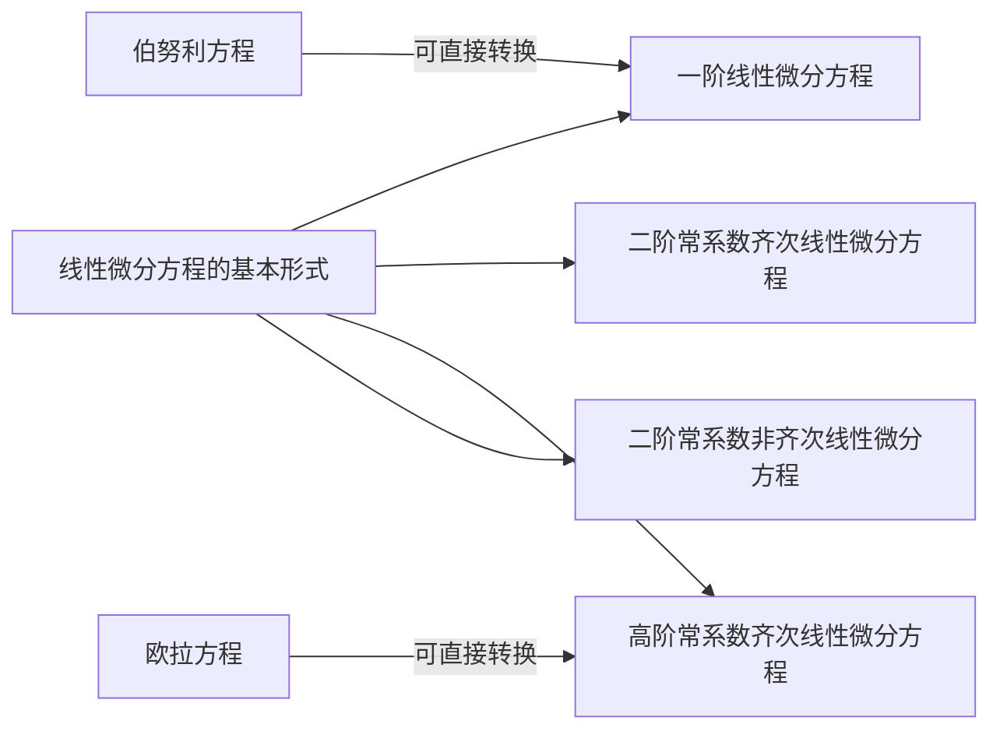

# 高等数学·8-下 线性微分方程

> **线性微分方程**是常微分方程章节中的重点知识，与线性微分方程有关的知识，其求解思路与其他常规的微分方程，如可分离变量的微分方程等需要利用微分推导、不定积分得出结果的微分方程不同，线性微分方程有自己的一套方法论，因此，我将所有与线性微分方程有关的知识整理到一个单独的章节中。

## 一、线性微分方程的基本形式

### 0x00 线性微分方程的基本形式

> 考纲摘要：理解线性微分方程解的性质及解的结构

齐次线性微分方程的基本形式如下所示：
$$
y^{(n)}+a_1(x)y^{(n-1)}+\dots+a_{n-1}(x)y'+a_n(x)y=0\cdots\cdots (1)
$$
它的一项基本性质：

- 如果 $y_1(x).y_2(x),\dots,y_n(x)$ 是上面的方程的 $n$ 个**线性无关**的解，那么，$y=C_1y_1(x)+C_2y_2(x)+\dots+C_ny_n(x)$ 就是这个方程的**通解**

> 对于 $n$ 个函数 $y_1(x),y_2(x),\dots,y_n(x)$，存在不全为零的 $n$ 个数 $k_1,k_2,\dots,k_n$，使得 $k_1y_1(x)+k_2y_2(x)+\dots+k_ny_n(x)\equiv 0$，则称这 $n$ 个函数是线性相关的，否则就是线性无关

非齐次线性微分方程的基本形式如下所示：
$$
y^{(n)}+a_1(x)y^{(n-1)}+\dots+a_{n-1}(x)y'+a_n(x)y=f(x)\cdots\cdots(2)
$$
非齐次线性微分方程的任意解被称作**特解**，其特解遵循一项重要性质，即**叠加原理**：

设 $y_1^*(x),y_2^*(x)$ 分别是
$$
y^{(n)}+a_1(x)y^{(n-1)}+\dots+a_{n-1}(x)y'+a_n(x)y=f_1(x)\\
y^{(n)}+a_1(x)y^{(n-1)}+\dots+a_{n-1}(x)y'+a_n(x)y=f_2(x)
$$
的特解，则 $y_1^*(x)+y_2^*(x)$ 是
$$
y^{(n)}+a_1(x)y^{(n-1)}+\dots+a_{n-1}(x)y'+a_n(x)y=f_1(x)+f_2(x)
$$
的特解。这就是叠加原理。也因此，假如 $y^*(x)$ 是 $(2)$ 式的特解，$Y(x)$ 是 $(1)$ 式的通解，那么，$Y(x)+y^*(x)$ 就是 $(2)$ 式的通解

### 0x01 常数变易法求非齐次线性微分方程的通解

> 本方法用于在已知非齐次线性微分方程对应的齐次线性微分方程的通解的基础上，求出非齐次线性微分方程的通解。

设已知的 $n$ 阶齐次线性微分方程的通解为
$$
Y(x)=\sum_{i=1}^nC_iy_i(x)
$$
可使用未知函数 $u_i(x),i=1,2,\cdots,n$ 来替换 $C_i,i=1,2,\cdots,n$，得到：
$$
y=\sum_{i=1}^nu_iy_i
$$
对其进行求导，有：$y'=\sum_{i=1}^nu_i'y_i+u_iy_i'$，设 $\sum_{i=1}^nu_i'y_i\equiv0$
在此条件下，此前求出的导数就变化为：$y'=\sum_{i=1}^nu_iy_i'$

再次对其进行求导，有：$y''=\sum_{i=1}^nu_i'y_i'+u_iy''_i$，设 $\sum_{i=1}^nu_i'y_i'\equiv0$
在此条件下，此前求出的导数就变化为：$y''=\sum_{i=1}^n u_iy_i''$

以此类推，设 $\sum_{i=1}^n u_i'y_i^{(j)}\equiv0,j=0,1,\cdots,n-2$，就有：
$y^{(j)}=\sum_{i=1}^nu_iy_i^{(j)},j=1,2,\cdots n-1$

同时也有：
$$
y^{(n)}=\sum_{i=1}^nu_i'y_i^{(n-1)}+u_iy_i^{(n)}
$$
将这些得到的 $y',y'',\cdots,y^{(n)}$ 代入到上一节的 $(2)$ 式中，就有：
$$
\sum_{i=1}^n[u_i'y_i^{(n-1)}+u_iy_i^{(n)}]
+a_1\sum_{i=1}^nu_iy_i^{(n-1)}+\cdots+a_{n-1}\sum_{i=1}^nu_iy_i'+a_n\sum_{i=1}^nu_iy_i=f,\\
$$
其展开的情形大致如下：
$$
\sum\begin{bmatrix}
u_1y_1^{(n)}&u_2y_2^{(n)}&\cdots&u_ny_n^{(n)}\\
a_1u_1y_1^{(n-1)}&a_2u_2y_2^{(n-1)}&\cdots&a_1u_ny_n^{(n-1)}\\
\vdots&\vdots&&\vdots\\
a_{n-1}u_1y_1'&a_{n-1}u_2y_2'&\cdots&a_{n-1}u_ny_n'\\
a_nu_1y_1&a_nu_2y_2&\cdots&a_nu_ny_n
\end{bmatrix}+\sum_{i=1}^nu_i'y_i^{(n-1)}=f
$$
这里的矩阵用来整理所有加法项，我们发现，每一列都可以整理为：
$$
u_i(y_i^{(n)}+a_1y_i^{(n-1)}+\cdots a_{n-1}y_i'+a_ny_i),i=1,2,\cdots,n
$$
显然，由于 $y_i,i=1,2,\cdots,n$ 是齐次线性微分方程的解，因此，矩阵中所有加法项的加和为 0，因此，可得：
$$
\sum_{i=1}^nu_i'y_i^{(n-1)}=f
$$
同时我们还有此前列出的条件：
$$
\sum_{i=1}^n u_i'y_i^{(j)}\equiv0,j=0,1,\cdots,n-2
$$
进而，我们可以得到如下所示的矩阵方程：
$$
\begin{bmatrix}
y_1&y_2&\cdots &y_n\\
y_1'&y_2'&\cdots& y_n'\\
\vdots&\vdots&&\vdots\\
y_1^{(n-2)}&y_2^{(n-2)}&\cdots&y_n^{(n-2)}\\
y_1^{(n-1)}&y_2^{(n-1)}&\cdots&y_n^{(n-1)}
\end{bmatrix}\begin{bmatrix}
u_1'\\u_2'\\\vdots\\u_{n-1}'\\u_n'
\end{bmatrix}=\begin{bmatrix}
0\\0\\\vdots\\0\\ f
\end{bmatrix}
$$
利用克拉默法则或者其他方法可以从中解出 $u_1',u_2',\cdots,u_n'$，然后对其进行积分即可得到 $u_1,u_2,\cdots,u_n$，将它们代入下式
$$
y=\sum_{i=1}^nu_iy_i
$$
得到的 $y$ 就是 0x00 节中 $(2)$ 式的一个特解，因此，$Y(x)+y(x)$ 正式所求的非齐次线性微分方程的通解

### 0x02 线性微分方程的退化

对线性微分方程的一般形式进行”退化“，即可得到考纲中要求的几类线性微分方程，我们后续会对这几类线性微分方程的解法进行细致探究。在考纲中，与线性微分方程有关的考点如下所示：

1. 掌握一阶线性微分方程的解法
2. 理解线性微分方程解的性质及解的结构
3. 掌握二阶常系数齐次线性微分方程的解法，并会解某些高于二阶的常系数齐次线性微分方程
4. 会解自由项为多项式、指数函数、正弦函数、余弦函数以及它们的和与积的二阶常系数非齐次线性微分方程
5. 会解欧拉方程

显然，将线性微分方程中导数的最大阶数限制为 1，就是**一阶线性微分方程**，其基本形式如下：
$$
y'+P(x)y=Q(x)
$$
将导数的最大阶数限制为 2 的齐次线性微分方程，同时所有变系数 $a_i(x)$ 设为常数，就是**二阶常系数齐次线性微分方程**，其基本形式如下：
$$
y''+py'+qy=0
$$
不对导数的最大阶数进行限制，仅将所有变系数设为常数的齐次线性微分方程，就是**常系数线性微分方程**，其基本形式如下：
$$
y^{(n)}+p_1y^{(n-1)}+\dots+p_{n-1}y'+p_ny=0
$$
考纲要求，对于这一类方程，只需会解“**某些**”即可，后续展开叙述时，将着重关注这个“某些”的范畴。

将导数的最大阶数限制为 2，将所有变系数设为常数，同时将自由项固定为这几类函数及其和或积的非齐次线性微分方程，就是第 4 个考点所划定的范围。

对于第 5 个考点，欧拉方程实际上可以化成一个常系数线性微分方程，可利用第 3、4 考点涉及的知识对其进行后续求解。

## 二、一阶线性微分方程

### 0x00 一阶线性微分方程的基本解法

> 考纲摘要：掌握一阶线性微分方程的解法

只需记住两个公式即可：

- $y'+P(x)y=0$ 的求解公式：$y=Ce^{-\int P(x)\mathrm dx}$
- $y'+P(x)y=Q(x)$ 的求解公式：$y=e^{-\int P(x)\mathrm dx}(C+\int Q(x)e^{\int P(x)\mathrm dx}\mathrm dx)$

推荐的演算步骤：

- 直接单独写出 $P(x),Q(x)$
- 计算 $\int P(x)\mathrm dx$
  - 可选：如果 $\int P(x)\mathrm dx$ 中含有 $\ln$ 因子，可直接计算出 $e^{\int P(x)\mathrm dx}$
- 将 $Q(x),\int P(x)\mathrm dx$ （或者 $e^{\int P(x)\mathrm dx}$）代入公式

> 推导过程如下：
>
> 首先考虑一阶线性齐次微分方程：
> $$
> \frac{\mathrm dy}{\mathrm dx}+P(x)y=0,
> \frac{\mathrm dy}{y}+P(x)\mathrm dx=0,\\
> \ln|y|+\int P(x)\mathrm dx+C_1=0\\
> y=e^{-C_1}e^{-\int P(x)\mathrm dx}
> $$
> 我们可以定义 $C=e^{-C_1}$，则一阶线性齐次微分方程的解就是：
> $$
> y=Ce^{-\int P(x)\mathrm dx}
> $$
> 然后，我们可以利用常数变易法来求一阶非齐次线性微分方程 $y'+P(x)y=Q(x)$ 的解：
>
> 设有 $u(x)$，直接借助常数变易法的公式，有：
> $$
> u'(x)e^{-\int P(x)\mathrm dx}=Q(x)\\
> u'(x)=Q(x)e^{\int P(x)\mathrm dx}\\
> u(x)=\int Q(x)e^{\int P(t)\mathrm dt}\mathrm dx +C\\
> $$
> 然后将其代入其一阶线性齐次微分方程的通解中的 $C$ 即可：
> $$
> y=e^{-\int P(x)\mathrm dx}(C+\int Q(x)e^{\int P(x)\mathrm dx}\mathrm dx)
> $$
>

### 0x01 伯努利方程

> 考纲摘要：会解伯努利方程

伯努利方程的基本形式：
$$
\frac{\mathrm dy}{\mathrm dx}+P(x)y=Q(x)y^n,(n\ne0,1)
$$

> 限定 $n\ne0,1$ 是因为如果 $n=0,1$，方程直接就是一个一阶线性微分方程

推荐的演算步骤：

- 将方程化成伯努利方程的形式，然后将 $n$ 给提取出来
- 令 $z=y^{1-n}$，求解 $z'+(1-n)P(x)z=(1-n)Q(x)$，套用一阶线性微分方程的步骤
- 解出 $z$ 后，直接得到 $y=z^{\cfrac1{1-n}}$

> <h3>求解原理</h3>
>
> 对这个方程变形：
> $$
> y^{-n}\frac{\mathrm dy}{\mathrm dx}+P(x)y^{1-n}=Q(x)
> $$
> 显然，$y^{-n}\mathrm dy=\cfrac1{1-n}\mathrm dy^{1-n}$
> 那么，只需令 $z=y^{1-n}$，就可以得到一个一阶线性微分方程：
> $$
> \frac{\mathrm dz}{\mathrm dx}+(1-n)P(x)z=(1-n)Q(x)
> $$
> 之后，按照一阶线性微分方程的解法求出 $z$ 后即可求出 $y$

## 三、常系数线性微分方程

### 0x00 二阶常系数齐次线性微分方程

> 考纲摘要：掌握二阶常系数齐次线性微分方程的解法

二阶常系数齐次线性微分方程的基本形式：$y''+py'+qy=0$
很容易求解，只需遵循以下步骤即可：

* 求解其**特征方程** $r^2+pr+q=0$，得到两个根 $r_1,r_2$
* 按照 $\Delta=p^2-4q$ 判别式的情况，对照下表写出通解即可

| 条件       | 通解                                            |
| ---------- | ----------------------------------------------- |
| $\Delta>0$ | $y=C_1e^{r_1x}+C_2e^{r_2x}$                     |
| $\Delta=0$ | $y=(C_1+C_2x)e^{rx}$                            |
| $\Delta<0$ | $y=e^{\alpha x}(C_1\cos\beta x+C_2\sin\beta x)$ |

其中，如果 $r_1,r_2$ 是两个复根，也就是 $\Delta<0$
且 $r_1=\alpha+\beta i,r_2=\alpha-\beta i$，其虚数表示中的 $\alpha,\beta$，就是通解里的参数

推荐的演算步骤：

- 计算判别式 $\Delta=p^2-4q$
- 使用判别式套用一元二次方程的求解公式解出 $r_1,r_2$
- 利用 $\Delta$ 的不同情况选择合适的通解形式：
  - 如果 $\Delta > 0$：$y = C_1 e^{r_1 x} + C_2 e^{r_2 x}$。
  - 如果 $\Delta = 0$：$y = (C_1 + C_2 x) e^{r x}$。
  - 如果 $\Delta < 0$：$y = e^{\alpha x} (C_1 \cos \beta x + C_2 \sin \beta x)$，其中 $r_1 = \alpha + \beta i, r_2 = \alpha - \beta i$。

- 根据初始条件，确定常数 $C_1, C_2$（如题目中有初始条件）。

> 相关讲解：
> 所谓的特征方程，其实就是假设 $y=e^{rx}$，这样一来，原方程就被化为：
> $$
> e^{rx}(r^2+pr+q)=0
> $$
> 进而我们能够求出 $r$ 的值进行代入到 $e^{rx}$ 中，从而得到满足原方程的解。
>
> $xe^{rx}$ 是由于 $\Delta=0$ 时，$r=-\cfrac p2$，在这种条件下，它才是原方程的一个特解
>
> $\Delta<0$ 时，$r$ 是一对共轭复数，需要使用欧拉公式 $e^{ix}=\cos x+i\sin x$ 进行推导

### 0x01 高阶常系数齐次线性微分方程

> 考纲摘要：会解某些高于二阶的常系数齐次线性微分方程

其基本形式：$y^{(n)}+p_1y^{(n-1)}+\dots+p_{n-1}y'+p_ny=0$

其特征方程为：$r^n+p_1r^{n-1}+\dots+p_{n-1}r+p_n=0$ 这是一个关于 $r$ 的 $n$ 次方程

| 特征方程的根                                 | 对应项数 | 微分方程通解中的对应项                                       |
| -------------------------------------------- | -------- | ------------------------------------------------------------ |
| 单实根 $r$                                   | 1        | $C^{rx}$                                                     |
| 一对单复根 $r_{1,2}=\alpha\pm\beta i$        | 2        | $e^{\alpha x}(C_1\cos\beta x+C_2\sin\beta x)$                |
| $k$ 重实根 $r$                               | k        | $e^{rx}(\sum_{i=1}^kC_ix^{i-1})$                             |
| 一对 [$k$ 重]复根 $r_{1,2}=\alpha\pm\beta i$ | 2k       | $e^{\alpha x}[(\sum_{i=1}^kC_ix^{i-1})\cos\beta x+(\sum_{i=1}^kD_ix^{i-1})\sin\beta x]$ |

这里的特征方程，仍是假设其根的形式是 $C^{rx}$ 的基础上得出的。对于这样一个 $n$ 次特征方程，它会有 $n$ 个根，其中，有重复和不重复的实数根，有重复和不重复的共轭复根对，而其每一个根，在通解中有对应的项，每一根对应的项，参照上表写出即可。

### 0x02 二阶非齐次常系数线性微分方程

> 考纲摘要：会解自由项为多项式、指数函数、正弦函数、余弦函数以及它们的和与积的二阶常系数非齐次线性微分方程

二阶常系数非齐次线性微分方程的一般形式：
$$
y''+py'+qy=f(x)
$$

要解这个方程，只需要求出 $y''+py'+qy=0$ 的通解 $Y(x)$ 及方程本身的特解 $y^*(x)$ 即可
而求解 $Y(x)$ 的方法在上一节已经充分讨论，在这里只需关注 $y^*(x)$ 的求解。
求解 $y^*$ 的一种方法是**待定系数法**，利用这种方法，不需要进行不定积分也可求解出该特解。

#### 1. $f(x)=e^{\lambda x}P_m(x)$ 型

- $\lambda$ 是特征方程的根的重数 $n$ ，则特解的形式可设为 $x^n e^{\lambda x}R_m(x)$，然后将其代入原方程，求解 $R_m$ 中的系数即可

这里 $P_m(x)$ 指的是一个关于 $x$ 的多项式，也就是：
$$
P_m(x)=a_0x^m+a_1x^{m-1}+\cdots+a_{m-1}x+a_m
$$
推荐的演算步骤：

- 提取出 $\lambda$ 和其特征方程 $\lambda^2+p\lambda+q=0$
- 根据 $\lambda$ 是否是特征方程的解的情况，确定 $R(x)$ 的形式
  - $\lambda$ 不是特征方程的根，则 $R(x)$ 是 $m$ 次多项式 $R_m(x)$
  - $\lambda$ 是特征方程的单根，则 $R(x)$ 是 $xR_m(x)$
  - $\lambda$ 是特征方程的重根，则 $R(x)$ 是 $x^2R_m(x)$
- 求 $R(x),R'(x),R''(x)$，并代入 $R''(x)+(2\lambda +p)R'(x)+(\lambda^2+p\lambda+q)R(x)=P_m(x)$
- 从中得到 $R_m$ 的系数列表 $\{b_i\}$ 与 $P_m$ 的系数列表 $\{a_i\}$ 的线性关系后，解线性方程组求解

>  <h3>求解原理</h3>
>
> 首先，推测 $y^*=R(x)e^{\lambda x}$ 是该方程的特解的形式，其中 $R(x)$ 是一个多项式。进一步有：
> $$
> y^*=R(x)e^{\lambda x}\\
> {y^*}'=e^{\lambda x}[\lambda R(x)+R'(x)]\\
> {y^*}''=e^{\lambda x}[\lambda^2R(x)+2\lambda R'(x)+R''(x)]
> $$
> 将它们代入原方程，左右约去 $e^{\lambda x}$，则有：
> $$
> R''(x)+(2\lambda +p)R'(x)+(\lambda^2+p\lambda+q)R(x)=P_m(x)
> $$
>
> - 如果 $\lambda^2+p\lambda+q\ne0$，则只需令 $R(x)=R_m(x)=b_0x^m+b_1x^{m-1}+\cdots+b_{m-1}x+b_m$，代入方程后，联立关于 $b_0,\cdots,b_m$ 与 $a_0,\cdots,a_m$ 的线性方程组进行求解即可
>
> - 如果 $\lambda$ 是 $r^2+pr+q=0$ 的单根，则 $\lambda^2+p\lambda+q=0,2\lambda+p\ne 0$
>   则只需令 $R(x)=xR_m(x)$，是一个 列线性方程组进行求解即可（$R'(x)$ 必须是 $m$ 次多项式）
> - 如果 $\lambda$ 是 $r^2+pr+q=0$ 的重根，则 $\lambda^2+p\lambda+q=0,2\lambda+p=0$
>   则只需令 $R(x)=x^2R_m(x)$，列线性方程组进行求解即可（$R''(x)$ 必须是 $m$ 次多项式）

#### 2. $f(x)=e^{\lambda x}[P_l(x)\cos\omega x+Q_n(x)\sin \omega x]$ 型

其中，$P_l(x),Q_n(x)$ 分别为 $l$ 次多项式，$n$ 次多项式

推荐的演算步骤：

- 根据共轭复数 $\lambda\pm\omega$ 是特征方程的共轭复根重数 $n$，构建特解形式 $x^ne^{\lambda x}[\rho_l(x)\cos\omega x+\phi_n(x)\sin\omega x]$，然后代入原方程求出 $\rho_l(x),\phi_n(x)$ 中的系数即可

- 构造 $P(x)=\cfrac{P_l(x)}{2}-\cfrac{Q_n}2i,\overline P(x)=\cfrac{P_l(x)}{2}+\cfrac{Q_n}2i$
- 构造 $y''+py'+qy=P(x)e^{(\lambda+\omega i)x},y''+py'+qy=\overline P(x)e^{(\lambda-\omega i)x}$
- 显然，$\lambda\pm\omega i$ 要么是特征方程的共轭根，要么均不是特征方程的根，因此，上述两个方程的特解只有两种情形：
  - $\lambda\pm\omega i$ 并非特征方程的共轭根，则两个特解的形式为 $y_1^*=R_me^{(\lambda+\omega i)x},y_2^*=\overline R_m e^{(\lambda-\omega i)x}$
  - $\lambda\pm\omega i$ 是特征方程的共轭根，则两个特解的形式为 $y_1^*=x R_me^{(\lambda+\omega i)x},y_2^*=x \overline R_m e^{(\lambda-\omega i)x}$
- 套用 $y''+py'+qy=e^{\lambda x}P_m(x)$ 的型方程的解法，得到上述两个方程的特解 $y_1^*,y_2^*$
- $y^*=y_1^*+y_2^*$，具体操作时，需要利用欧拉公式将指数含有 $i$ 的项转换为三角函数

> <h3>求解原理</h3>
>
> 首先可以利用欧拉公式将 $f(x)$ 表示成复变指数函数的形式：
> $$
> f(x)=e^{\lambda x}[P_l\cos\omega x+Q_n\sin\omega x]=\\
> e^{\lambda x}\left[
> P_l\frac{e^{\omega xi}+e^{-\omega xi}}{2}+Q_n\frac{e^{\omega xi}-e^{-\omega xi}}{2i}
> \right]=\\
> \left(\frac{P_l}{2}+\frac{Q_n}{2i}\right)e^{(\lambda+\omega i)x}+
> \left(\frac{P_l}{2}-\frac{Q_n}{2i}\right)e^{(\lambda-\omega i)x}=\\
> P(x)e^{(\lambda+\omega i)x}+\overline P(x)e^{(\lambda-\omega i)x}
> $$
> 其中，$P(x),\overline P(x)$ 是共轭的 $m$ 次多项式，$m=\max\{l,n\}$：
> $$
> P(x)=\frac{P_l}{2}+\frac{Q_n}{2i}=\frac{P_l}{2}-\frac{Q_n}{2}i\\
> \overline P(x)=\frac{P_l}{2}-\frac{Q_n}{2i}=\frac{P_l}{2}+\frac{Q_n}{2}i\\
> $$
> 利用求解 $f(x)=e^{\lambda x}P_m(x)$ 的方法求解
> $$
> y''+py'+qy=P(x)e^{(\lambda+\omega i)x}\\
> $$
> 得到 $y_1^*=x^k R_me^{(\lambda+\omega i)x}$，而 $y_2^*=x^k\overline R_m e^{(\lambda-\omega i)x}$ 则是
> $$
> y''+py'+qy=\overline P(x)e^{(\lambda-\omega i)x}
> $$
> 的特解。其中，$R_m,\overline R_m$ 是共轭的多项式。$y_1^*,y_2^*$ 是共轭的，因此它们相加后无虚部且为原方程的特解，因此：
> $$
> y^*=x^ke^{\lambda x}[R_me^{\omega xi}+\overline R_me^{-\omega xi}]=\\
> x^ke^{\lambda x}[R_m(\cos\omega x+i\sin\omega x)+\overline R_m(\cos\omega x-i\sin\omega x)]=\\
> x^ke^{\lambda x}[R_m^{(1)}(x)\cos\omega x+R_m^{(2)}(x)\sin\omega x]
> $$

$y^*=x^ke^{\lambda x}[R_m^{(1)}(x)\cos\omega x+R_m^{(2)}(x)\sin\omega x]$，这就是特解可设为的形式。

其中，$R_m^{(1)}(x),R_m^{(2)}(x)$ 是 $m$ 次多项式，$m=\max\{l,n\}$，$k$ 的取值：

- 如果 $\lambda+\omega i$ 不是特征方程的根，则 $k=0$
- 如果 $\lambda+\omega i$ 是特征方程的单根，则 $k=1$

## 四、欧拉方程

> 考纲摘要：会解欧拉方程

欧拉方程的一般形式：
$$
x^ny^{(n)}+p_1x^{n-1}y^{(n-1)}+\cdots+p_{n-1}xy'+p_ny=f(x)
$$
做变换 $x=e^t,t=\ln x$，则有：
$$
\frac{\mathrm dy}{\mathrm dx}=\frac{\mathrm dy}{\mathrm dt}\cdot\frac{\mathrm dt}{\mathrm dx}=\frac 1x\frac{\mathrm dy}{\mathrm dt},\\
\frac{\mathrm d^2 y}{\mathrm dx^2}=\frac1{x^2}\left(\frac{\mathrm d^2y}{\mathrm dt^2}-\frac{\mathrm dy}{\mathrm dt}\right)\\
\frac{\mathrm d^3y}{\mathrm dx^3}=\frac1{x^3}\left(
\frac{\mathrm d^3y}{\mathrm dt^3}-3\frac{\mathrm d^2y}{\mathrm dt^2}+2\frac{\mathrm dy}{\mathrm dt}
\right)
$$
一般地，有：
$$
x^ky^{(k)}=
\left(\frac{\mathrm d}{\mathrm dt}\right)
\left(\frac{\mathrm d}{\mathrm dt}-1\right)\cdots
\left(\frac{\mathrm d}{\mathrm dt}-k+1\right)y
$$
将其代入欧拉方程，即可得到一个以 $t$ 为自变量的常系数线性微分方程，然后进一步求解即可。

推荐的演算步骤：

- 分别算出 $x=e^t$ 代入 $x_i\cfrac{\mathrm d^iy}{dx^2}$ 后的 $a_{n-i}\cfrac{\mathrm d^iy}{\mathrm dt^i}$
- 将上述一系列结果代入欧拉方程，这是一个关于 $y(t)$ 的常系数线性微分方程，按照相应的方法解出 $y(t)$ 即可
- 从 $y(t)$ 直接得回 $y(x)$

