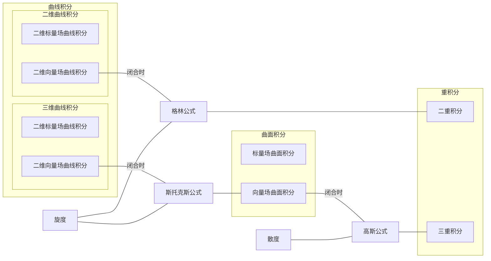

# 故事新编-曲线及曲面积分

## 〇、基本

### 0x00 脑图

### 0x01 考纲

#### 1. 考试内容

- 二重积分与三重积分的概念、性质、计算和应用
- 两类曲线积分的概念、性质及计算
- 两类曲线积分的关系
- 格林（Green）公式
- 平面曲线积分与路径无关的条件
- 二元函数全微分的原函数
- 两类曲面积分的概念、性质及计算
- 两类曲面积分的关系
- 高斯（Gauss）公式
- 斯托克斯（Stokes）公式
- 散度、旋度的概念及计算
- 曲线积分和曲面积分的应用

#### 2. 考试要求

1. 理解二重积分、三重积分的概念，了解重积分的性质，，了解二重积分的中值定理

2. 掌握二重积分的计算方法（直角坐标、极坐标），会计算三重积分（直角坐标、柱面坐标、球面坐标）

3. 理解两类曲线积分的概念，了解两类曲线积分的性质及两类曲线积分的关系

4. 掌握计算两类曲线积分的方法

5. 掌握格林公式并会运用平面曲线积分与路径无关的条件，会求二元函数全微分的原函数

6. 了解两类曲面积分的概念、性质及两类曲面积分的关系，掌握计算两类曲面积分的方法，掌握用高斯公式计算曲面积分的方法，并会用斯托克斯公式计算曲线积分

7. 了解散度与旋度的概念，并会计算

8. 会用重积分、曲线积分及曲面积分求一些几何量与物理量（平面图形的面积、体积、曲面面积、弧长、质量、质心、形心、转动惯量、引力、功及流量等）

## 一、标量场、向量场、散度与旋度

在开始掌握曲线积分与曲面积分之前，我们应该首先厘清什么是标量场和向量场：

- **标量场**：是一个函数，为空间中的每个点赋予一个标量值，基本形式为：$f(x,y),f(x,y,z)$
- **向量场**：可以理解为是一个向量函数，其基本形式为：$\mathbf F=[P(x,y),Q(x,y)],\mathbf F=[P(x,y,z),Q(x,y,z),R(x,y,z)]$

从而更精准地定义考纲中的以下概念：

- **第一类曲线积分**：对标量场的曲线积分
- **第二类曲线积分**：对向量场的曲线积分
- **第一类曲面积分**：对标量场的曲面积分
- **第二类曲面积分**：对向量场的曲面积分

而在关于针对**向量场**的曲线、曲面积分中，有一些十分有用的公式，而使用**散度**与**旋度**可以更加简洁的定义这些公式。

而在给出散度和旋度的定义之前，我们首先需要了解 $\nabla$ 算子，以下是二维空间和三维空间中 $\nabla$ 算子的定义：
$$
\R^2:\nabla=\left(\frac{\part}{\part x},\frac{\part}{\part y}\right)\\
\R^3:\nabla=\left(\frac{\part}{\part x},\frac{\part}{\part y}，\frac{\part}{\part z}\right)
$$
利用 $\nabla$ 算子，我们可以简洁地定义此前在多元函数微分学中学习的**梯度**、向量场的**散度**与**旋度**
这里，我们仅给出 $\R^3$ 上的定义：

- 对于标量场函数 $f(x,y,z)$，其**梯度**如下所示：

$$
\nabla f=\left(\frac{\part f}{\part x},\frac{\part f}{\part y}，\frac{\part f}{\part z}\right)
$$

- 对于向量场 $\mathbf F=(P,Q,R)$：

  - 其**散度**如下所示：
    $$
    \nabla\cdot\mathbf F=\frac{\part P}{\part x}+\frac{\part Q}{\part y}+\frac{\part R}{\part z}
    $$

  - 其**旋度**如下所示：
    $$
    \nabla\times\mathbf F=\begin{vmatrix}
    \mathbf i&\mathbf j&\mathbf k\\
    \cfrac{\part}{\part x}&\cfrac{\part}{\part y}&\cfrac{\part}{\part z}\\
    P&Q&R
    \end{vmatrix}=\left(
    \frac{\part R}{\part y}-\frac{\part Q}{\part z},
    \frac{\part P}{\part Z}-\frac{\part R}{\part x},
    \frac{\part Q}{\part x}-\frac{\part P}{\part y}
    \right)
    $$

  - 然而，对于二维向量场 $\mathbf F=(P,Q)$，其旋度是一个标量，如下所示：
    $$
    \operatorname{curl}(\mathbf F)=\frac{\part Q}{\part x}-\frac{\part P}{\part y}
    $$
    由于向量积无法很自然地定义在二维空间上，我们这里不再对二维向量场的旋度展开讨论，以免破坏我们当前的理论体系的完备性。

可以看到，**梯度**类似于向量的**数乘**，**散度**类似于向量的**数量积**，**旋度**类似于向量的**向量积**

## 二、曲线积分

### 0x00 第一类曲线积分(标量场曲线积分)

二维标量场曲线积分的基本形式如下所示：
$$
\int_Lf(x,y)\mathrm ds
$$

其中，$\mathrm ds$ 可以表示成如下形式：
$$
\mathrm ds=\sqrt{\mathrm dx^2+\mathrm dy^2}
$$
标量场曲线积分的解法相对简单，当曲线 $L$ 可以表示成如下形式时：
$$
L:\begin{cases}
x=\varphi(t)\\
y=\psi(t)
\end{cases},t\in[\alpha,\beta]
$$
原本的积分就可以转换成以下积分进行求解：
$$
\int_L f(x,y)\mathrm ds=
\int_\alpha^\beta f[\varphi(t),\psi(t)]\sqrt{\mathrm d\varphi(t)^2+\mathrm d\psi(t)^2}=
\int_\alpha^\beta f[\varphi(t),\psi(t)]\sqrt{\varphi'(t)^2+\psi'(t)^2}\mathrm dt
$$
对于三维标量场曲线积分也可以有类似的解法：
$$
\int_L f(x,y,z)\mathrm ds=\int_\alpha^\beta f[\varphi(t),\psi(t),\omega(t)]\sqrt{\varphi'^2(t)+\psi'^2(t)+\omega'^2(t)}\mathrm dt
$$

### 0x01 第二类曲线积分(向量场曲线积分)

向量场曲线积分的基本形式如下所示：
$$
\int_L \mathbf F\cdot\mathrm d\mathbf r
$$
其中，$\mathrm d\mathbf r=(\mathrm dx,\mathrm dy,\mathrm dz)$，当然，这里取决于维数，这里以三维空间中的向量场曲线积分为例。

计算方法也相对简单，当曲线 $L$ 可以表示成如下形式时：
$$
L:\begin{cases}
x=\varphi(t)\\
y=\psi(t)\\
z=\omega(t)
\end{cases},t\in[\alpha,\beta]
$$
直接将其代入原式即可。

### 0x02 格林公式

格林公式揭示了二维向量场积分中，当积分曲线为闭合曲线时，该曲线积分与二重积分的关系。格林公式如下所示：
$$
\oint_L\mathbf F\cdot\mathrm d\mathbf r=
\iint_D\operatorname{curl}(\mathbf F)\mathrm d\sigma=
\iint_D\left(\frac{\part Q}{\part x}-\frac{\part P}{\part y}\right)\mathrm d\sigma
$$
其中，$D$ 是 $L$ 所围起来的一个曲面。

事实上，我们有一个结论：当 $\operatorname{curl}(\mathbf F)=0$ 时，该向量场的积分是**路径无关**的，而这也与格林公式的形式相呼应：当 $\operatorname{curl}(\mathbf F)=0$ 时，格林公式转化出的二重积分显然为 0，前面的闭合曲线积分可以视作起点与终点一致的积分，因此如果其积分路径无关，那么必然为 0

## 三、曲面积分

### 0x00 第一类曲面积分(标量场曲面积分)

基本形式如下所示：
$$
\iint_\Sigma f(x,y,z)\mathrm dS
$$
其中，$\mathrm dS$ 的形式较为复杂，且其形式依赖于曲面 $\Sigma$，当其可以用以下参数方程表示时：
$$
\Sigma:\begin{cases}
x=x(u,v)\\
y=y(u,v)\\
z=z(u,v)
\end{cases},\mathbf r=(x,y,z)
$$
那么，$\mathrm dS$ 就可以表示为：
$$
\mathrm dS=\left|\frac{\part \mathbf r}{\part u}\times\frac{\part \mathbf r}{\part v}\right|\mathrm du\mathrm dv
$$
显然，这里所求的正是 $\Sigma$ 的两个切向量 $\cfrac{\part\mathbf r}{\part u},\cfrac{\part\mathbf r}{\part v}$ 组成的平行四边形的面积，这就是微面积元的表示形式

而在 $\mathrm dS$ 替换成含有 $\mathrm du\mathrm dv$ 形式后，确定 $(u,v)$ 的取值范围，即可将原积分转换成二重积分。

>例子：
>
>对于可用 $z=z(x,y)$ 的曲面，我们有：
>$$
>\Sigma:\mathbf r=(x,y,z(x,y))\\
>\mathrm dS=\left|\frac{\part \mathbf r}{\part x}\times\frac{\part \mathbf r}{\part y}\right|\mathrm dx\mathrm dx=
>\left|\begin{vmatrix}
>\mathbf i&\mathbf j&\mathbf k\\
>1&0&\frac{\part z}{\part x}\\
>0&1&\frac{\part z}{\part y}
>\end{vmatrix}\right|\mathrm dx\mathrm dy=
>\left|\left(-\frac{\part z}{\part x},-\frac{\part z}{\part y},1\right)\right|\mathrm dx\mathrm dy=
>\sqrt{1+\left(\frac{\part z}{\part x}\right)^2+\left(\frac{\part z}{\part y}\right)^2}\mathrm dx\mathrm dy
>$$
> 而 $\Sigma$ 转换为 $(x,y)$ 的取值范围，也就是 $\Sigma$ 在 $xOy$ 平面上的投影，这就是为什么我们有以下等式：
>$$
>\iint_\Sigma f(x,y,z)\mathrm dS=\iint_{D_{xy}}f[x,y,z(x,y)]\sqrt{1+\left(\frac{\part z}{\part x}\right)^2+\left(\frac{\part z}{\part y}\right)^2}\mathrm dx\mathrm dy
>$$
>参考一元函数定积分 $\int_a^b f(x)\mathrm dx$ 的换元法：令 $x=g(y)$，则原积分转换为 $\int_{g^{-1}(a)}^{g^{-1}(b)}f[g(y)]g'(y)\mathrm dy$，微元变换后，积分域也随之变换
>
>这里，$\mathrm dS$ 变换成 $\mathrm dx\mathrm dy$ 后，积分域也随之从 $\Sigma$ 变换成它在 $xOy$ 上的投影 $D_{xy}$

#### 例题

计算以下曲面积分
$$
\iint_\Sigma(x^2+y^2)\mathrm dS,\Sigma:z=x^2+y^2,0\le z\le 1
$$
设 $x=r\cos\theta,y=r\sin\theta$，显然，$\theta\in[-\pi,\pi]$，$z=r^2,r=\sqrt z$，因此，$r\in[0,1]$
$$
\mathbf R=(r\cos\theta,r\sin\theta,r^2)\\
\mathrm dS=\left|\frac{\part\mathbf R}{\part r}\times \frac{\part\mathbf R}{\part \theta}\right|\mathrm dr\mathrm d\theta=
|(\cos\theta,\sin\theta,2r)\times(-r\sin\theta,r\cos\theta,0)|\mathrm dr\mathrm d\theta=r\sqrt{4r^2+1}\mathrm dr\mathrm d\theta\\
\therefore\iint_\Sigma (x^2+y^2)\mathrm dS=\int_{-\pi}^\pi\mathrm d\theta\int_0^1 r^3\sqrt{4r^2+1}\mathrm dr=
2\pi\int_0^1 r^3\sqrt{4r^2+1}\mathrm dr=\\
\pi\int_0^1r^2\sqrt{4r^2+1}\mathrm dr^2=\frac{25\sqrt{5}+1}{60}\pi
$$

### 0x01 第二类曲面积分(向量场曲面积分)

基本形式如下所示：
$$
\iint_\Sigma \mathbf F\cdot\mathrm d\mathbf S
$$

这里的 $\mathrm d\mathbf S$ 可以表示成如下形式：
$$
\mathrm d\mathbf S=\mathbf n\mathrm dS
$$
其中，$\mathbf n$ 是 $\Sigma$ 的**单位法向量**。这里，我们可以尝试推导 $\mathrm d\mathbf S$ 的表示形式。

假设 $\Sigma$ 可以用以下参数形式表示：
$$
\mathbf r=(\varphi(u,v),\psi(u,v),\omega(u,v))
$$
则有：
$$
\mathrm dS=\left|\frac{\part\mathbf r}{\part u}\times\frac{\part\mathbf r}{\part v}\right|dudv
$$
由于 $\cfrac{\part\mathbf r}{\part u},\cfrac{\part\mathbf r}{\part v}$ 是 $\Sigma$ 的两个切向量，因此其向量积就是其法向量，同时还需要对其进行单位化，因此，其 $\mathbf n$ 就可以表示为：
$$
\mathbf n=\frac{1}{\left|\frac{\part\mathbf r}{\part u}\times\frac{\part\mathbf r}{\part v}\right|}
\left(\frac{\part\mathbf r}{\part u}\times\frac{\part\mathbf r}{\part v}\right)
$$
因此，$\mathrm d\mathbf S$ 就可以表示为：
$$
\mathrm d\mathbf S=\left(\frac{\part\mathbf r}{\part u}\times\frac{\part\mathbf r}{\part v}\right)\mathrm du\mathrm dv
$$
显然，这里的 $\mathbf n$ 只是对 $\Sigma$ 垂直，我们并未规定其方向，而**有向曲面**的方向正是取决于我们如何取定 $\mathbf n$ 的

另外，我们这里有一个结论：

对于向量场 $\mathbf F=(P,Q,R)$，以下等式成立：
$$
\iint_\Sigma\mathbf F\cdot\mathrm d\mathbf S=\iint_\Sigma P\mathrm dy\mathrm dz+Q\mathrm dx\mathrm dz+R\mathrm dx\mathrm dy
$$

#### 例题

题目：计算：
$$
\iint_\Sigma 2z\mathrm dx\mathrm dy+xz\mathrm dy\mathrm dz,\Sigma:z=\sqrt{1-x^2-y^2}
$$
$\Sigma$ 取上侧

> 我的解答过程：那么，向量场为 $\mathbf F=(xz,0,2z)$，积分可写成如下形式：
> $$
> \iint_\Sigma (xz,0,2z)\mathrm d\mathbf S
> $$
> 然后处理一下 $\Sigma$ ，它显然是一个半球面
> $$
> \begin{cases}
> x=\sin\varphi\cos\theta\\
> y=\sin\varphi\sin\theta\\
> z=\cos\varphi
> \end{cases},
> \theta\in[-\pi,\pi],\varphi\in[0,\frac{\pi}{2}]
> $$
> 将 $\mathrm d\mathbf S$ 按 $(\varphi,\theta)$ 展开：
> $$
> (\cos\varphi\cos\theta,\cos\varphi\sin\theta,-\sin\varphi)\times(-\sin\varphi\sin\theta,\sin\varphi,\cos\theta,0)\mathrm d\varphi\mathrm d\theta=\\
> \begin{vmatrix}
> \mathbf i&\mathbf j&\mathbf k\\
> \cos\varphi\cos\theta&\cos\varphi\sin\theta&-\sin\varphi\\
> -\sin\varphi\sin\theta&\sin\varphi\cos\theta&0
> \end{vmatrix}\mathrm d\varphi\mathrm d\theta=
> (\sin^2\varphi\cos\theta,\sin^2\varphi\sin\theta,\cos\varphi\sin\varphi)\mathrm d\varphi\mathrm d\theta
> $$
> 然后将其代入原积分：
> $$
> \int_{-\pi}^{\pi}\mathrm d\theta\int_0^{\frac{\pi}{2}}(\sin\varphi\cos\varphi\cos\theta,0,2\cos\varphi)\cdot(\sin^2\varphi\cos\theta,\sin^2\varphi\sin\theta,\cos\varphi\sin\varphi)\mathrm d\varphi=\\
> \int_{-\pi}^{\pi}\mathrm d\theta\int_0^{\frac{\pi}{2}}(\sin^3\varphi\cos\varphi\cos^2\theta+2\cos^2\varphi\sin\varphi)\mathrm d\varphi=
> \int_{-\pi}^{\pi}(\frac{1}{4}\cos^2\theta+\frac{2}{3})\mathrm d\theta=\frac{19}{12}\pi
> $$

### 0x02 斯托克斯公式

斯托克斯公式揭示了**向量场的空间闭合曲线积分**与**向量场的曲面积分**之间的关系，其基本形式如下所示：
$$
\oint_L\mathbf F\cdot\mathrm d\mathbf r=\iint_\Sigma\nabla\times\mathbf F\mathrm d\mathbf S
$$

其中，$\Sigma$ 是以 $L$ 为边界的任意曲面。

事实上，这里我们可能会存在一个疑问，任意以 $L$ 为边界的曲面的积分，被积的向量场看上去都一样，然而，实际上 $\mathrm d\mathbf S$ 的取定是与 $\Sigma$ 紧密相关的，因此，在实际计算时，得到的曲面积分的最终形式会根据曲面的不同而有所不同

### 0x03 高斯公式

高斯公式揭示了**向量场的闭合曲面积分**与**三重积分**之间的关系，其基本形式如下所示：
$$
\iiint_\Omega\nabla\cdot\mathbf F\mathrm dv=\oiint_\Sigma \mathbf F\cdot\mathrm d\mathbf S
$$

其中，$\Omega$ 是以 $\Sigma$ 为边界的区域

